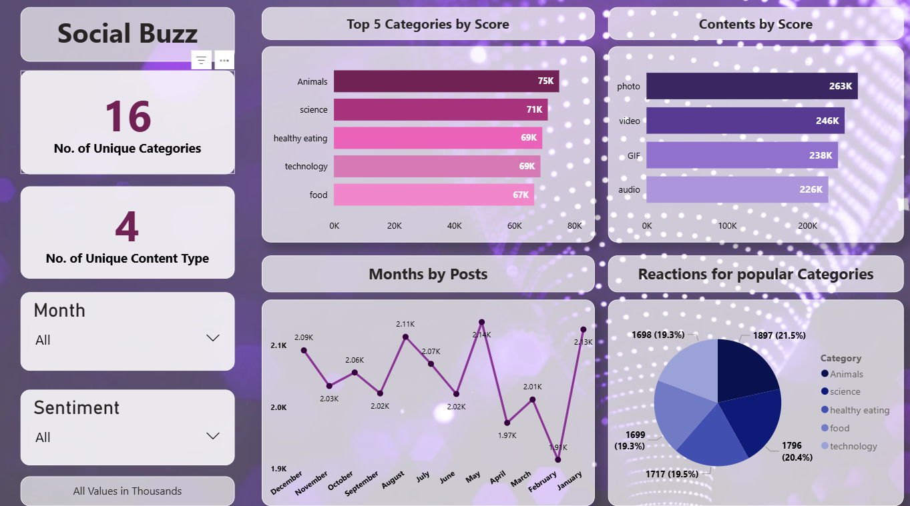

# 📊 Accenture Social Buzz Analysis — Virtual Internship

Completed as part of the **Accenture Data Analytics & 
Visualization Virtual Internship** on Forage.

---

## 🏢 About the Internship

Forage is a platform offering virtual work experience 
programs from top companies. This project simulates 
real analyst work at Accenture, working on a client 
brief for a fictional tech company — Social Buzz.

---

## 📌 Client Brief

Social Buzz is a fast-growing social media company 
generating over 100,000 pieces of content every day. 
Accenture was engaged to help them prepare for a 
global IPO by auditing their big data practice and 
identifying their top-performing content categories.

---

## ✅ Tasks Completed

**Task 1 — Data Understanding & Extraction**
- Downloaded and explored 3 datasets from the client
- Identified relevant tables and fields for analysis

**Task 2 — Data Cleaning**
- Cleaned datasets using Excel and Power Query
- Removed nulls, fixed data types, merged tables

**Task 3 — Data Analysis & Visualization**
- Built a Power BI dashboard to answer client questions
- Identified top 5 content categories by engagement score

**Task 4 — Client Presentation**
- Created a professional PowerPoint presentation
- Summarized insights and recommendations for stakeholders

---

## 📊 Dashboard

---

## 💡 Key Insights

- **Animals** is the top performing category with 75K score
- **Science** and **Healthy Eating** follow closely at 71K and 69K
- **Photos** are the most consumed content format (263K)
- **January** sees the highest number of posts monthly
- Top 5 categories account for evenly distributed reactions,
  suggesting a well-balanced content ecosystem

---

## 📁 Files

| File | Description |
|------|-------------|
| `dashboard.png` | Power BI dashboard screenshot |
| `Accenture Data Analysis.pdf` | Final client presentation |

---

## 🛠️ Tools Used

- Microsoft Excel + Power Query (data cleaning)
- Power BI (dashboard and visualization)
- PowerPoint (client presentation)

---

## 🏆 Context

This project was completed via the **Accenture Data 
Analytics Virtual Experience Program** on 
[Forage](https://www.theforage.com/) — a platform 
providing real-world work simulations from top companies.
